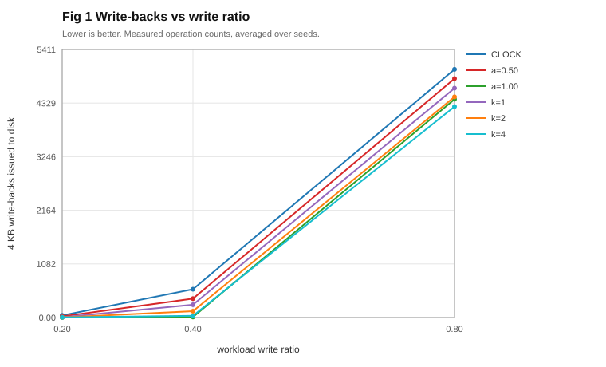

# CA-CLOCK

A demand-paging system for Windows that runs on real CPU page faults. Not a simulation.

Built for CSE 323, Operating Systems.

**▶ [Watch the demo video](PASTE_YOUR_VIDEO_LINK_HERE)** (about 4 minutes)



## The problem

Your program needs more memory than the machine has. Something must go out to disk. Which page?

FIFO, LRU and CLOCK all answer by recency, and we grade them on how many page faults they cause. That scoring quietly assumes every eviction costs the same. It doesn't. Throwing out a clean page is free, because the copy on disk is still valid. Throwing out a changed page means writing it back first.

CA-CLOCK protects changed pages when the clock hand comes around, then measures whether that actually pays off.

## Why this isn't a simulator

Three things happen for real, and you can verify all of them:

- **The page faults.** Touch memory that isn't loaded and the CPU raises an access violation. A vectored exception handler catches it and pages in from disk.
- **The memory limit.** `VirtualAlloc` commits a page, `VirtualFree(MEM_DECOMMIT)` hands it back. Windows enforces the budget. My code doesn't just decrement a counter and pretend.
- **The disk.** The backing file opens with `FILE_FLAG_NO_BUFFERING`, so every read and write skips the Windows cache and reaches the drive.

## Quick start

You need MinGW g++ and Python 3. The analysis script uses only the standard library, so there is nothing to install.

```
.\build.bat
.\ca-clock.exe config\demo.ini
```

The `.\` matters. PowerShell refuses to run a program from the current folder without it.

That second command is the one to watch. It slows everything down so you can see the algorithm working:

```
frames [rDDrrrr.]  resident 7/8  faults 7  page-ins 7  write-backs 0
        ^
```

One letter per slot in memory. `r` is loaded and clean, `D` has been changed, `.` is empty, and `^` is the clock hand hunting for something to evict.

Other things you can run:

```
.\selftest.exe --quick                      9 tests, correctness only (13 s)
.\probe.exe                                 the data-loss check
.\ca-clock.exe --calibrate                  measure your disk's read and write cost
.\run_experiments.bat                       the full sweep (about 45 min)
python analysis\analyse.py results\sample_runs.csv results\device.csv
```

## What I found

Two results surprised me, and one of them nearly broke the whole premise.

### Writes are not always the expensive operation

The entire project assumes writing to disk costs more than reading. So I measured it. On my laptop's hard drive:

| Mode | Read | Write | Write / read |
|---|---|---|---|
| Normal write-through | 949 µs | 534 µs | **0.56** |
| Flush after every write | 930 µs | 21,692 µs | **23.34** |

A write costs about half a read until you demand durability. Then it costs twenty-three reads. Same machine, same file, one config flag. That's a factor of forty, and it decides whether protecting changed pages is worth anything at all. This is why the program measures your disk instead of assuming a number.

### A good-looking result can come from a broken algorithm

Sweep the protection strength up to maximum and disk writes drop. Looks like a win. So I added a counter for how often the clock hand searched all of memory and found nothing it was allowed to evict.

At a heavy write load, 1024 pages and 64 frames:

| Policy | Disk writes | Failed searches | Cost vs CLOCK |
|---|---|---|---|
| CLOCK (baseline) | 5,010 | 0.0% | |
| Unlimited protection | 4,406 | **59.2%** | −7.7% |
| Limited to 4 skips | **4,257** | **0.0%** | **−10.2%** |

The middle row is the interesting one. It reports a 7.7% improvement while failing to behave like CLOCK in 59% of its evictions. It had degraded into near-random replacement, and the headline number hid that completely.

Capping the skips fixed it. A page can dodge eviction, but only *k* times, then it goes. That version is cheaper *and* it never runs out of candidates, because the scan is bounded by construction.

## How to read the numbers

Operation counts (page-ins, write-backs) reproduce exactly. Same config, same seed, same counts, every time. The tests check this.

Timing does not reproduce. Two runs doing identical work reported 14 s and 28 s on my machine, because disk latency drifts with whatever else is happening. So cost is modelled, not timed. `--calibrate` measures your disk once and the analysis applies that single measurement to every run being compared. The figures say so on their face.

## What's in here

| Path | What it does |
|---|---|
| `src/arena.cpp` | The fault handler, page commits, evictions |
| `src/policy.cpp` | CLOCK and both cost-aware variants |
| `src/store.cpp` | Unbuffered disk I/O and disk calibration |
| `tests/selftest.cpp` | 9 tests |
| `tests/probe_dirty.cpp` | The probe that found the data-loss bug |
| `analysis/analyse.py` | Reads the CSV, writes SVG figures |
| `DEVLOG.md` | What broke, and how I worked it out |

## Limitations

Everything here runs single-threaded in user space, on one laptop with one hard drive. An SSD would give you different numbers, and probably a narrower gap between reading and writing.

The sweep only covers normal write-through mode. Durable mode is the case where a write costs twenty-three reads, which is exactly where protecting changed pages should pay off best, and I calibrated it but never swept it. That's the obvious next experiment.

Workloads are synthetic. Zipf and sequential patterns, not traces from real programs. And the protection strength is a number you pass in, not something the program works out for itself from the disk measurement.

## References

The core idea here is not mine. Two papers do the same thing:

- Park et al. "CFLRU: A Replacement Algorithm for Flash Memory." CASES 2006. Prefers evicting clean pages.
- Jung et al. "LRU-WSR: Integration of LRU and Writes Sequence Reordering for Flash Memory." IEEE Trans. Consumer Electronics, 2008. Gives a changed page one extra chance.

Both evaluate in simulation against an assumed cost ratio. This project runs on real page faults, measures the ratio on the actual machine, and reports when the algorithm stops working properly.

Silberschatz, Galvin and Gagne, *Operating System Concepts*, for the page replacement background. Microsoft's Win32 documentation for `VirtualAlloc`, `VirtualProtect`, `AddVectoredExceptionHandler`, `CreateFile` and `QueryPerformanceCounter`.
